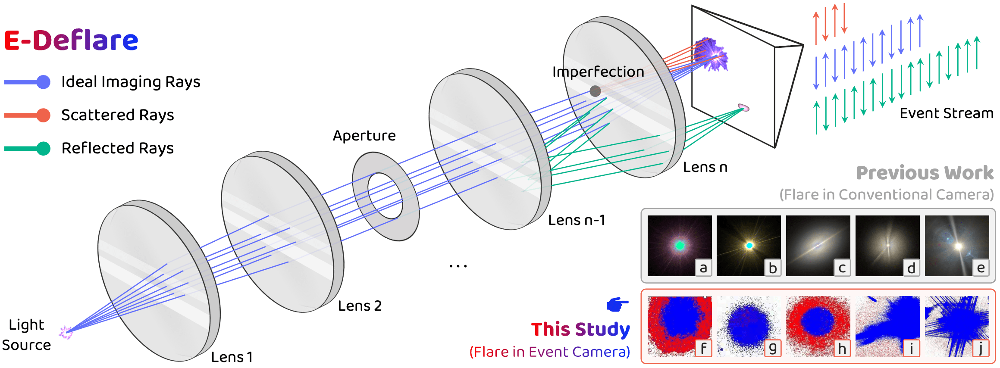
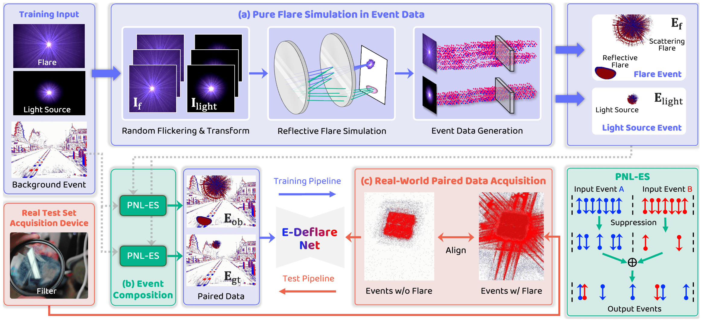
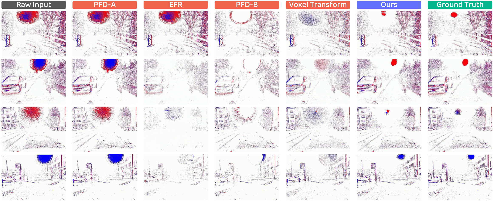
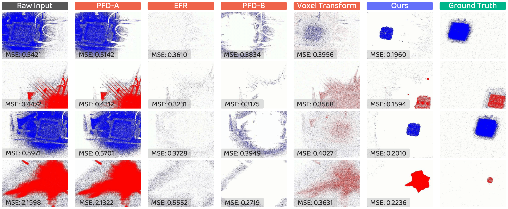

<p align="right">English | <a href="./README_CN.md">简体中文</a></p>  


<p align="center">
  

  <h1 align="center">
    <strong>Learning to Remove Lens Flare in Event Camera</strong>
  </h1>

  <p align="center">
    <a href="https://openreview.net/profile?id=~Haiqian_Han1" target="_blank"><strong>Haiqian Han</strong></a>&nbsp;&nbsp;&nbsp;&nbsp;
    <a href="https://ldkong.com/" target="_blank"><strong>Lingdong Kong</strong></a>&nbsp;&nbsp;&nbsp;&nbsp;
    <a href="https://jianing-li.github.io/" target="_blank"><strong>Jianing Li</strong></a>&nbsp;&nbsp;&nbsp;&nbsp;
    <a href="https://alanliangc.github.io/" target="_blank"><strong>Ao Liang</strong></a>&nbsp;&nbsp;&nbsp;&nbsp;
    <a href="https://openreview.net/profile?id=~Chengtao_Zhu1" target="_blank"><strong>Chengtao Zhu</strong></a>&nbsp;&nbsp;&nbsp;&nbsp;
    <a href="https://openreview.net/profile?id=~Jiacheng_Lyu1" target="_blank"><strong>Jiacheng Lyu</strong></a>&nbsp;&nbsp;&nbsp;&nbsp;
    <a href="https://ipal.cnrs.fr/lai-xing-ng/" target="_blank"><strong>Lai Xing Ng</strong></a><br>   
    <a href="https://www.au.tsinghua.edu.cn/info/1080/3178.htm" target="_blank"><strong>Xiangyang Ji</strong></a>&nbsp;&nbsp;&nbsp;&nbsp;
    <a href="https://www.comp.nus.edu.sg/cs/people/ooiwt/" target="_blank"><strong>Wei Tsang Ooi</strong></a>&nbsp;&nbsp;&nbsp;&nbsp;
    <a href="https://ipal.cnrs.fr/benoit-cottereau-personal-page/" target="_blank"><strong>Benoit R. Cottereau</strong></a>    
  </p>

  <p align="center">
    <a href="" target='_blank'>
      
    </a>&nbsp;
    <a href="https://e-flare.github.io/" target='_blank'>
      
    </a>&nbsp;
    <a href="https://huggingface.co/datasets/e-flare/data" target='_blank'>
      
    </a>&nbsp;
    <a href="" target='_blank'>
      
    </a>
  </p>
</p>


|  |
| :-: |


Event cameras have the potential to revolutionize vision systems with their high temporal resolution and dynamic range, yet they remain susceptible to lens flare, a fundamental optical artifact that causes severe degradation. In event streams, this optical artifact forms a complex, spatio-temporal distortion that has been largely overlooked.

We present the **first** systematic framework for removing lens flare from event camera data. 
- We first establish the theoretical foundation by deriving a physics-grounded forward model of the non-linear suppression mechanism.
- This insight enables the creation of the `E-Deflare` benchmark, a comprehensive resource featuring a large-scale simulated training set, `E-Flare-2.7K`, and the first-ever paired real-world test set, `E-Flare-R`, captured by our novel optical system.
- Empowered by this benchmark, we design `E-DeflareNet`, which achieves state-of-the-art restoration performance.

Extensive experiments validate our approach and demonstrate clear benefits for downstream tasks.


### :books: Citation
If you find this work helpful for your research, please kindly consider citing our papers:

```bibtex
@article{han2025e-deflare,
    title   = {Learning to Remove Lens Flare in Event Camera},
    author  = {Haiqian Han and Lingdong Kong and Jianing Li and Ao Liang and Chengtao Zhu and Jiacheng Lyu and Lai Xing Ng and Xiangyang Ji and Wei Tsang Ooi and Benoit R. Cottereau},
    journal = {arXiv preprint arXiv:2512.xxxxx}
    year    = {2025}
}
```


## Updates

- **[12/2025]** - The `E-Flare-2.7K`, `E-Flare-R`, and `DSEC-Flare` datasets are ready for download at the [HuggingFace Page](https://huggingface.co/datasets/E-Deflare/data).
- **[12/2025]** - The [Project Page](https://e-flare.github.io) is online. :rocket:


## Outline
- [Installation](#gear-installation)
- [Data Preparation](#hotsprings-data-preparation)
- [Getting Started](#rocket-getting-started)
- [E-Deflare Benchmark](#triangular_ruler-e-deflare-benchmark)
- [TODO List](#memo-todo-list)
- [License](#license)
- [Acknowledgements](#acknowledgements)


## :gear: Installation
For details related to installation and environment setups, kindly refer to [INSTALL.md](docs/INSTALL.md).


## :hotsprings: Data Preparation
Kindly refer to our **HuggingFace Dataset** :hugs: page from [here](https://huggingface.co/datasets/E-Deflare/data) for more details.


## :rocket: Getting Started
To learn more usage of this codebase, kindly refer to [GET_STARTED.md](docs/GET_STARTED.md).


## :triangular_ruler: E-Deflare Benchmark

### Data Curation, Training & Validation
| |
| :-: |


### Summary of Datasets

<table class="table is-bordered is-striped is-hoverable" style="width: 100%;">
  <thead>
    <tr>
      <th style="vertical-align: middle; width: 25%;">Dataset</th>
      <th style="vertical-align: middle; width: 15%;">Type</th>
      <th style="vertical-align: middle; width: 20%;">Split</th>
      <th style="vertical-align: middle; width: 15%;"># Samples</th>
      <th style="vertical-align: middle; width: 25%;">Description</th>
    </tr>
  </thead>
  <tbody>
    <!-- E-Flare-2.7K -->
    <tr>
      <td rowspan="2" style="vertical-align: middle;"><b>E-Flare-2.7K</b></td>
      <td rowspan="2" style="vertical-align: middle; color: #2E86AB;">Simulated</td>
      <td style="vertical-align: middle;">Train</td>
      <td style="vertical-align: middle;">2,545</td>
      <td rowspan="2" style="vertical-align: middle; text-align: left;">Large-scale simulated training set. Each sample is a 20ms voxel grid</td>
    </tr>
    <tr>
      <td style="vertical-align: middle;">Test</td>
      <td style="vertical-align: middle;">175</td>
    </tr>
    <!-- E-Flare-R -->
    <tr>
      <td style="vertical-align: middle;"><b>E-Flare-R</b></td>
      <td style="vertical-align: middle; color: #A23B72;">Real-World</td>
      <td style="vertical-align: middle;">Test</td>
      <td style="vertical-align: middle;">150</td>
      <td style="vertical-align: middle; text-align: left;">Real-world paired test set for sim-to-real evaluation</td>
    </tr>
    <!-- DSEC-Flare -->
    <tr>
      <td style="vertical-align: middle;"><b>DSEC-Flare</b></td>
      <td style="vertical-align: middle; color: #A23B72;">Real-World</td>
      <td style="vertical-align: middle;">—</td>
      <td style="vertical-align: middle;">—</td>
      <td style="vertical-align: middle; text-align: left;">Curated sequences from DSEC showcasing lens flare in public datasets</td>
    </tr>
  </tbody>
</table>


### Qualitative Results on E-Flare-2.7K
| |
| :-: |


### Qualitative Results on E-Flare-R
| |
| :-: |


## :memo: TODO List
- [x] Initial release. 🚀
- [ ] Release of the `E-Flare-2.7K`, `E-Flare-R`, and `DSEC-Flare` datasets.
- [ ] Release of the E-DeflareNet model.
- [ ] . . .


## License
This work is under the <a rel="license" href="https://www.apache.org/licenses/LICENSE-2.0">Apache License Version 2.0</a>, while some specific implementations in this codebase might be under other licenses. Kindly refer to [LICENSE.md](docs/LICENSE.md) for a more careful check, if you are using our code for commercial matters.


| |
| :-: |


## Acknowledgements
This work is under the programme [DesCartes](http://descartes.cnrsatcreate.cnrs.fr/) and is supported by the National Research Foundation, Prime Minister's Office, Singapore, under its Campus for Research Excellence and Technological Enterprise (CREATE) programme. This work is also supported by the [Apple Scholars in AI/ML Ph.D. Fellowship](https://machinelearning.apple.com/updates/apple-scholars-aiml-2025) program.

